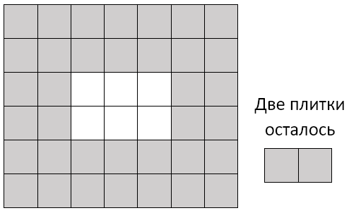

# G. Площадь
https://contest.yandex.ru/contest/27844/problems/G/

#### Ограничение времени
Все языки\
0.5 секунд\
GNU C11 7.3, GNU c++ 11 4.9, GNU c++ 11 x32 4.9, GCC 5.4.0 C++14, GNU c++ 14 4.9, GNU c++17 7.3, GCC C++17\
0.3 секунды
#### Ограничение памяти
Все языки\
64Mb\
GNU C11 7.3, GNU c++ 11 4.9, GNU c++ 11 x32 4.9, GCC 5.4.0 C++14, GNU c++ 14 4.9, GNU c++17 7.3, GCC C++17\
256Mb
#### Ввод
стандартный ввод или input.txt
#### Вывод
стандартный вывод или output.txt

Городская площадь имеет размер n× m и покрыта квадратной плиткой размером 1× 1. При плановой замене плитки выяснилось, что новой плитки недостаточно для покрытия всей площади, поэтому было решено покрыть плиткой только дорожку по краю площади, а в центре площади разбить прямоугольную клумбу (см. рисунок к примеру). При этом дорожка должна иметь одинаковую ширину по всем сторонам площади. Определите максимальную ширину дорожки, которую можно выложить из имеющихся плиток.

## Формат ввода

Первая и вторая строки входных данных содержат по одному числу n и m (3≤ n ≤ 2×1e9, 3≤ m ≤ 2×1e9) — размеры площади.

Третья строка содержит количество имеющихся плиток t, 1≤ t< nm.

Обратите внимание, что значение t может быть больше, чем возможное значение 32-битной целочисленной переменной, поэтому необходимо использовать 64-битные числа (тип int64 в языке Pascal, тип long long в C и C++, тип long в Java и C#).

## Формат вывода

Программа должна вывести единственное число — максимальную ширину дорожки, которую можно выложить из имеющихся плиток.

## Пример
#### Ввод
6\
7\
38
#### Вывод
2

## Примечания
Пояснение к примеру. Площадь имеет размеры 6×7, из 38 плиток можно выложить дорожку шириной в 2 плитки.\
